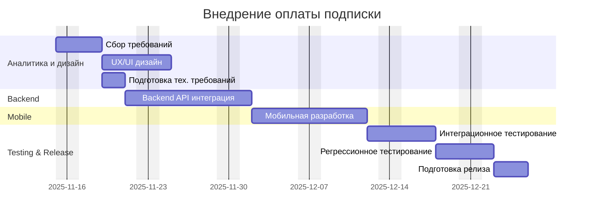

# PM_TZ

Тестовое задание на позицию Junior Project Manager.
Документ включает анализ проблемы, предложения по улучшению процессов, коммуникацию со стейкхолдерами и план реализации фичи.

Часть 1 — Идентификация ключевых проблем
1. Отсутствие приоритетов и фокуса

Разные запросы от СЕО (иконка, монетизация, новый раздел) — нет единого направления.

2. Слабая синхронизация между ролями

Дизайнер делает макеты без фактических данных, Android заблокирован из-за отсутствия API, тестирование без контекста.

3. Нет прозрачного статуса и релиз-плана

Команда и маркетинг не понимают, что и когда будет готово.

4. Технические риски

У iOS-разработчика падает база данных при нагрузке в 10 пользователей — критичный блокер.

5. Неуправляемый поток задач от СЕО

Задачи приходят напрямую в команду, минуя процесс приоритизации.

Часть 2 — Методология и первые шаги
1. Предложенная методология

Scrumban — сочетание Scrum-ритмов и Kanban-подходов.
Позволит структурировать процессы, уменьшить хаос и быстрее отрабатывать приоритеты.

2. Повестка первой встречи

- Синхронизация текущего статуса

- Выявление блокеров

- Определение приоритетов на ближайшие недели

- Согласование рабочего процесса (доска, статусы, ежедневки)

3. Мини-бэклог первых задач

- Собрать и зафиксировать требования по тренировкам и подписке.

- Согласовать API и разблокировать Android-разработчика.

- Починить падение базы данных на тестовом стенде.

- Синхронизировать дизайн с реальными требованиями.

- Обновить и опубликовать релиз-план.

Часть 3 — Письмо СЕО

Тема: Статус по монетизации и дальнейшие шаги

Здравствуйте!

Спасибо за информацию. Задачу по внедрению оплаты подписки зафиксировала как основной приоритет команды.
Сейчас собираю статус по зависимостям, чтобы подготовить реалистичный план-график реализации.

В течение двух дней предоставлю вам детальный план по монетизации с оценкой сроков.

Редизайн иконки и новый раздел с питанием предлагаю временно отложить — это снизит риски и позволит выполнить цели квартала.

Держу вас в курсе.
С уважением,
Мария.

Часть 4 — Диаграмма Ганта: «Внедрение оплаты подписки»

Обоснование плана

План построен по стандартному циклу фичи: аналитика → дизайн → backend → мобильная разработка → тестирование → релиз.
Основные риски: стабильность базы, возможные задержки на backend, модерация в сторах (+3–5 дней, не включено в сроки).
Задачи распределены последовательно, учитывая взаимодействия.
